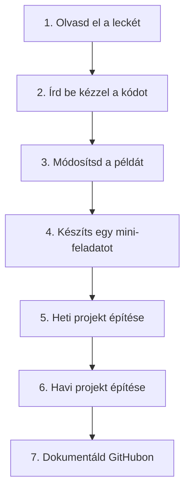

# Tanulási stratégia

A programozás, és ezen belül a **Flutter mobilfejlesztés** elsajátítása nem passzív tevékenység. Sokan esnek abba a hibába, hogy órákon át néznek videókat vagy olvasnak cikkeket, majd amikor megnyitják a kódszerkesztőt, tehetetlenül állnak az üres képernyő előtt. Ezt a jelenséget nevezik a **„tutorial hell”** (oktatóvideó-csapda) állapotának.

Hogy ezt elkerüld, az alábbi, gyakorlatban bevált tanulási stratégiát javasoljuk ezen a kurzuson.

---

## 🔁 A 7 lépéses tanulási ciklus

A tananyag minden egyes leckéjénél kövesd a következő lépéseket:

### 1. Olvasd el a leckét
Első lépésként fusd át az elméleti részt. Értsd meg a koncepciót, a miérteket és a logikát. Ne akarj azonnal mindent megjegyezni, a lényeg a globális kép megértése.

### 2. Írd be kézzel a példakódot (Copy-Paste tilalom!)
Soha ne másold ki és illeszd be a példakódokat! 
* A kód kézi begépelése aktiválja a **motorikus memóriát** (izommemóriát).
* Gépelés közben észreveszed a szintaxis apró részleteit (zárójelek, pontosvesszők, kulcsszavak).
* A kézi gépelés során óhatatlanul elkövetett elírások és az azokból adódó hibaüzenetek a legjobb tanítómesterek.

### 3. Módosíts rajta
Miután a példakód hibátlanul fut:
* Változtass meg benne változókat, értékeket.
* Próbálj ki új paramétereket.
* Figyeld meg, hogyan változik a program viselkedése vagy a UI kinézete. Ez adja meg az igazi megértést.

### 4. Készíts mini-feladatot
Minden fejezet végén találsz apróbb gyakorló feladatokat. Oldd meg őket önállóan. Ha elakadsz, nézz vissza az elméletre, de próbálj meg külső segítség nélkül célba érni.

### 5. Hetente építs egy kis projektet
A hét végén található mini-projektek összefogják az addig tanultakat. Ezek már önálló, működő kis alkalmazások (konzolban vagy mobilon), amelyek fejlesztése során a nulláról kell felépítened a logikát.

### 6. Minden hónap végén készíts egy nagyobb projektet
A megszerzett tudás megszilárdítására a havi mérföldkő-projektek szolgálnak. Ezek összetettebbek, és már több témakört (pl. hálózat, adatbázis, állapottárolás) kombinálnak.

### 7. Dokumentáld GitHubon
Minden megírt kódodnak a GitHubon a helye!
* Tanuld meg használni a Git verziókezelőt.
* Készíts tiszta commitokat.
* Írj minden projekthez egy rövid, de szép `README.md` leírást (mit csinál az app, hogyan lehet futtatni, milyen technológiákat használtál).
* Ez a portfóliód alapja, amit később a HR-esek és a technikai vezetők látni fognak.

---

## 🐞 A hibakezelés mint tanulási módszer

Ne ijedj meg, ha piros hibaüzenetek árasztják el a konzolt. A szoftverfejlesztés jelentős része hibakeresésből (**debugging**) áll.
1. **Olvasd el a hibaüzenetet:** A Dart és a Flutter hibaüzenetei rendkívül beszédesek. Gyakran pontosan leírják, mi a gond és hol található a kódban.
2. **Keresd meg a sor számát:** A stack trace-ben keresd meg a saját fájlod nevét és a sorszámot.
3. **Tanulj a hibából:** Ha megértetted, miért szállt el a kód, legközelebb már reflexből fogod tudni a megoldást.

---

## 🤖 Hogyan használd az AI (mesterséges intelligencia) eszközöket?

A ChatGPT, a Gemini és a GitHub Copilot korában a tanulás felgyorsulhat, de el is lustaulhatsz tőle. Íme az arany középút:

| ❌ Helytelen használat |  Helyes használat |
| :--- | :--- |
| *„Generáld le nekem a heti projekt teljes kódját.”* | *„Magyarázd el lépésről lépésre, hogyan működik a FutureBuilder Dartban.”* |
| Kimásolod az AI által írt kódot anélkül, hogy értenéd. | Megmutatod a hibás kódot az AI-nak, és megkéred, hogy magyarázza el, miért kaptad a hibaüzenetet. |
| Az AI gondolkodik helyetted. | Az AI-t kód-felülvizsgálatra (**code review**) használod, hogy tippeket kérj a kódod szebbé tételére. |

---

> [!TIP]
> A tanulásban a legfontosabb a **konzisztencia**. Napi 1 óra fókuszált tanulás és kódolás sokkal többet ér, mint ha csak hétvégén ülnél le 7 órára. Alakítsd ki a napi rutinodat!
