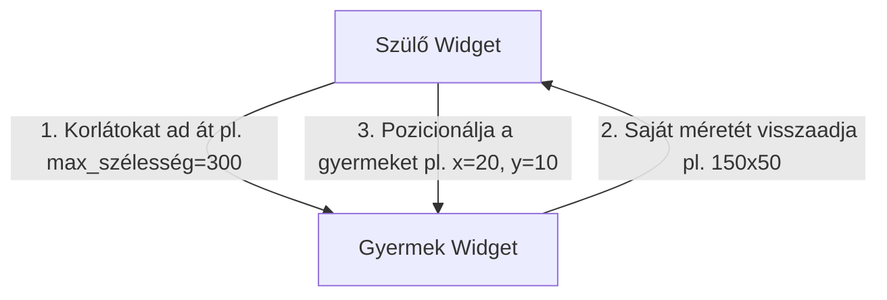

# 3. hét — Layout mélyebben

## Cél
Ezen a héten mélyen megismerkedünk a Flutter elrendezési (layout) rendszerével. Megértjük az alapvető layout szabályt ("Constraints go down..."), megtanuljuk használni a legfontosabb méretező és igazító widgeteket, és képessé válunk reszponzív, különböző képernyőméretekhez (telefonok, táblagépek) és tájolásokhoz (álló, fekvő) alkalmazkodó felületek tervezésére. Megvizsgáljuk a leggyakoribb elrendezési hibákat, és megtanuljuk szakszerűen elhárítani őket.

---

## Elmélet

### 3.1 A Flutter Layout Alapelve: Constraints Go Down...
A Flutter layout motorjának működése három egyszerű, de rendkívül fontos szabályra épül:
1.  **Constraints go down (A korlátok lefelé mennek):** A szülő (parent) widget átad bizonyos korlátokat (constraints) a gyermekének. Ezek a korlátok határozzák meg a minimális és maximális szélességet és magasságot (pl. "minimum 100px, maximum 300px széles lehetsz").
2.  **Sizes go up (A méretek felfelé mennek):** A gyermek (child) widget a kapott korlátok alapján kiválasztja a saját méretét, és ezt jelzi a szülőnek (pl. "szeretnék 150px széles és 50px magas lenni").
3.  **Parent sets position (A szülő határozza meg a pozíciót):** A szülő widget a gyermek méretét ismerve elhelyezi őt a koordináta-rendszerben (pl. balra igazítva, középre téve, vagy a sor következő elemeként).



Ha egy widget nem tartja be a szülője által kapott korlátokat, vagy ha a korlátok ütköznek (például végtelen korlátot kap egy görgethető nézet belsejében), layout hiba keletkezik.

#### A legfontosabb Layout Widgetek csoportosítása:

*   **Rugalmas méretezés:**
    *   `Expanded`: Kitölti a rendelkezésre álló szabad helyet egy `Column`-ban vagy `Row`-ban. Ha több `Expanded` van, a `flex` attribútum alapján osztoznak az arányokon.
    *   `Flexible`: Hasonló az `Expanded`-hez, de nem kötelező kitöltenie a teljes szabad helyet; a gyermek felvehet kisebb méretet is.
    *   `Spacer`: Egy üres, rugalmas térköz, ami kitölti a helyet a widgetek között (praktikusan egy üres `Expanded`).

*   **Pozicionálás és Igazítás:**
    *   `Padding`: Belső margót ad a gyermeknek (`EdgeInsets`).
    *   `Align`: A gyermeket a szülő területén belül egy megadott pontra igazítja (pl. `Alignment.bottomRight`).
    *   `Center`: A gyermek widgetet pontosan középre helyezi (az `Align` egy speciális esete).

*   **Fix méretezés és arányok:**
    *   `SizedBox`: Fix szélességű és/eller magasságú doboz. Gyakran használjuk két widget közötti távolság beállítására.
    *   `AspectRatio`: A gyermeket egy fix képarány szerint méretezi (pl. 16:9).

*   **Túlfolyás és reszponzivitás kezelése:**
    *   `Wrap`: Hasonló a `Row`-hoz vagy `Column`-hoz, de ha a gyermekek kifutnak a képernyőből, automatikusan új sorba vagy oszlopba tördelődnek.
    *   `LayoutBuilder`: Futás közben hozzáférést biztosít a szülő által adott korlátokhoz (`BoxConstraints`), így dinamikusan építhetünk fel eltérő UI-t telefonra és tabletre.
    *   `MediaQuery`: Információt nyújt a képernyő tényleges fizikai méretéről, tájolásáról és a rendszer betűméret-skálázásáról.
    *   `SafeArea`: Megvédi a UI-t attól, hogy a kijelző kivágásai (notch, kamerasziget) vagy az operációs rendszer állapotsorai alá csússzon.

### 3.2 Gyakori Layout Hibák és Megoldásaik

#### 1. Unbounded Height / Width (Végtelen magasság hiba)
*   **Hiba:** `Vertical viewport was given an unbounded height` vagy `RenderBox was not laid out`.
*   **Ok:** Ez akkor történik, ha egy végtelen magasságot igénylő widgetet (pl. egy függőleges `ListView`-t) egy olyan widgetbe teszünk, ami nem korlátozza a gyermek magasságát (pl. egy `Column`-ba). Mivel a `Column` végtelen helyet biztosít függőlegesen, a `ListView` megpróbál végtelen magas lenni, ami összeomlást okoz.
*   **Megoldás:**
    *   Csomagold be a `ListView`-t egy `Expanded` widgetbe, így a `Column` megmaradt szabad magasságát kapja meg korlátként.
    *   Vagy használd a `ListView` `shrinkWrap: true` tulajdonságát (ha a lista rövid, és szeretnéd, hogy csak a szükséges helyet foglalja el) és állítsd be a `physics: const NeverScrollableScrollPhysics()`-et, hogy ne ütközzön a görgetési logika.

#### 2. Screen Overflow (Pixel túlfolyás)
*   **Hiba:** Sárga-fekete csíkos doboz jelenik meg a képernyő szélén, `A RenderFlex overflowed by X pixels on the right/bottom` felirattal.
*   **Ok:** A gyermekek mérete meghaladja a szülő által biztosított maximális fizikai képernyőméretet (pl. egy `Row`-ban a szöveg túl hosszú és kilóg a képernyőről).
*   **Megoldás:**
    *   Csomagold a túlfolyó widgetet (pl. a `Text`-et) `Expanded` vagy `Flexible` widgetbe, így kénytelen lesz alkalmazkodni a maradék helyhez és szükség esetén tördelődni.
    *   Ha függőleges túlfolyás van a billentyűzet megjelenése miatt, csomagold a képernyő tartalmát `SingleChildScrollView` widgetbe.

#### 3. Expanded és Flexible Rossz Elhelyezése
*   **Hiba:** `Incorrect use of ParentDataWidget`.
*   **Ok:** Az `Expanded`, `Flexible` és `Spacer` widgeteket **kizárólag** `Row`, `Column` vagy `Flex` közvetlen gyermekeként szabad használni. Ha például egy `Container` belsejébe teszed őket, futásidejű hibát kapsz.

### 3.3 Reszponzív Mobil UI Tervezése
A modern mobilalkalmazásoknak felkészültnek kell lenniük a változó körülményekre:
*   **Billentyűzet kezelése:** Amikor a felhasználó rákattint egy szövegmezőre, felugrik a virtuális billentyűzet. Ez csökkenti a látható képernyőmagasságot. Ha a UI-nk nem görgethető (`SingleChildScrollView`), a billentyűzet eltolja vagy lefedi a gombokat, és overflow hibát okozhat.
*   **Notch és System Bar:** A modern telefonok tetején kamerasziget található, alul pedig szoftveres navigációs sáv. A `SafeArea` automatikusan hozzáadja a szükséges paddinget a kijelző szélén, hogy a tartalom mindig jól látható legyen.
*   **Portrait vs Landscape:** A képernyő elforgatásakor a szélesség és magasság felcserélődik. Ezt kezelhetjük az elrendezés cseréjével (pl. `Column`-ból `Row`-ba váltunk elforgatáskor) a `MediaQuery` tájolási adata (`orientation`) alapján.

---

## Kódpéldák

### Reszponzív Képernyő LayoutBuilder és MediaQuery Használatával
Az alábbi példa egy olyan dashboard képernyőt mutat be, amely telefonon egy oszlopban jeleníti meg a kártyákat, míg táblagépen vagy fekvő módban két oszlopos rács elrendezésre vált.

```dart
import 'package:flutter/material.dart';

void main() {
  runApp(const MyApp());
}

class MyApp extends StatelessWidget {
  const MyApp({super.key});

  @override
  Widget build(BuildContext context) {
    return MaterialApp(
      theme: ThemeData(useMaterial3: true, colorSchemeSeed: Colors.indigo),
      home: const ResponsiveDashboardScreen(),
    );
  }
}

class ResponsiveDashboardScreen extends StatelessWidget {
  const ResponsiveDashboardScreen({super.key});

  @override
  Widget build(BuildContext context) {
    // Képernyőorientáció és méret lekérése MediaQuery-val
    final mediaQuery = MediaQuery.of(context);
    final isLandscape = mediaQuery.orientation == Orientation.landscape;

    return Scaffold(
      appBar: AppBar(
        title: const Text('Reszponzív Dashboard'),
        backgroundColor: Theme.of(context).colorScheme.primaryContainer,
      ),
      body: SafeArea(
        child: LayoutBuilder(
          builder: (context, constraints) {
            // Megnézzük a szülő által biztosított maximális szélességet
            if (constraints.maxWidth > 600) {
              // Nagyobb képernyő (Tablet vagy Landscape): Kétoszlopos elrendezés
              return _buildGridTemplate(columns: 2, isLandscape: isLandscape);
            } else {
              // Mobil képernyő (Portrait): Egyoszlopos elrendezés
              return _buildListTemplate();
            }
          },
        ),
      ),
    );
  }

  // Egyoszlopos mobil nézet görgethető listával
  Widget _buildListTemplate() {
    return ListView(
      padding: const EdgeInsets.all(16.0),
      children: const [
        DashboardCard(title: 'Aktív Felhasználók', value: '1,248', icon: Icons.people, color: Colors.blue),
        SizedBox(height: 12),
        DashboardCard(title: 'Havi Bevétel', value: '4,520,000 Ft', icon: Icons.monetization_on, color: Colors.green),
        SizedBox(height: 12),
        DashboardCard(title: 'Szerverterhelés', value: '14%', icon: Icons.dns, color: Colors.orange),
        SizedBox(height: 12),
        DashboardCard(title: 'Rendszerüzenetek', value: '3 olvasatlan', icon: Icons.notifications, color: Colors.purple),
      ],
    );
  }

  // Kétoszlopos rács elrendezés
  Widget _buildGridTemplate({required int columns, required bool isLandscape}) {
    return GridView.count(
      crossAxisCount: columns,
      childAspectRatio: isLandscape ? 2.5 : 1.5,
      padding: const EdgeInsets.all(16.0),
      mainAxisSpacing: 16.0,
      crossAxisSpacing: 16.0,
      children: const [
        DashboardCard(title: 'Aktív Felhasználók', value: '1,248', icon: Icons.people, color: Colors.blue),
        DashboardCard(title: 'Havi Bevétel', value: '4,520,000 Ft', icon: Icons.monetization_on, color: Colors.green),
        DashboardCard(title: 'Szerverterhelés', value: '14%', icon: Icons.dns, color: Colors.orange),
        DashboardCard(title: 'Rendszerüzenetek', value: '3 olvasatlan', icon: Icons.notifications, color: Colors.purple),
      ],
    );
  }
}

// Újrahasználható egyedi Dashboard kártya widget
class DashboardCard extends StatelessWidget {
  final String title;
  final String value;
  final IconData icon;
  final Color color;

  const DashboardCard({
    super.key,
    required this.title,
    required this.value,
    required this.icon,
    required this.color,
  });

  @override
  Widget build(BuildContext context) {
    return Card(
      elevation: 4,
      shape: RoundedRectangleBorder(borderRadius: BorderRadius.circular(16)),
      child: Padding(
        padding: const EdgeInsets.all(20.0),
        child: Row(
          children: [
            CircleAvatar(
              radius: 28,
              backgroundColor: color.withOpacity(0.1),
              child: Icon(icon, color: color, size: 28),
            ),
            const SizedBox(width: 16),
            Expanded(
              child: Column(
                crossAxisAlignment: CrossAxisAlignment.start,
                mainAxisAlignment: MainAxisAlignment.center,
                children: [
                  Text(
                    title,
                    style: const TextStyle(fontSize: 14, color: Colors.grey, fontWeight: FontWeight.w500),
                    overflow: TextOverflow.ellipsis,
                  ),
                  const SizedBox(height: 4),
                  Text(
                    value,
                    style: const TextStyle(fontSize: 20, fontWeight: FontWeight.bold),
                    overflow: TextOverflow.ellipsis,
                  ),
                ],
              ),
            ),
          ],
        ),
      ),
    );
  }
}
```

---

## Gyakorlófeladatok & Megoldások

### 1. Feladat: Rugalmas Login Képernyő
Készíts egy bejelentkező képernyőt logóval, két beviteli mezővel és egy gombbal. Biztosítsd, hogy ha felugrik a billentyűzet, a tartalom görgethetővé váljon és ne okozzon sárga-fekete pixel túlfolyást.

#### Megoldás:
```dart
import 'package:flutter/material.dart';

void main() => runApp(const MaterialApp(home: LoginScreen()));

class LoginScreen extends StatelessWidget {
  const LoginScreen({super.key});

  @override
  Widget build(BuildContext context) {
    return Scaffold(
      body: SafeArea(
        child: Center(
          child: SingleChildScrollView(
            padding: const EdgeInsets.symmetric(horizontal: 24.0, vertical: 16.0),
            child: Column(
              mainAxisAlignment: MainAxisAlignment.center,
              crossAxisAlignment: CrossAxisAlignment.stretch,
              children: [
                const Icon(Icons.lock_person, size: 100, color: Colors.indigo),
                const SizedBox(height: 24),
                const Text(
                  'Üdvözöljük!',
                  textAlign: TextAlign.center,
                  style: TextStyle(fontSize: 28, fontWeight: FontWeight.bold),
                ),
                const SizedBox(height: 8),
                const Text(
                  'Kérjük, jelentkezzen be a folytatáshoz.',
                  textAlign: TextAlign.center,
                  style: TextStyle(color: Colors.grey),
                ),
                const SizedBox(height: 32),
                const TextField(
                  decoration: InputDecoration(
                    labelText: 'E-mail cím',
                    prefixIcon: Icon(Icons.email),
                    border: OutlineInputBorder(),
                  ),
                ),
                const SizedBox(height: 16),
                const TextField(
                  obscureText: true,
                  decoration: InputDecoration(
                    labelText: 'Jelszó',
                    prefixIcon: Icon(Icons.lock),
                    border: OutlineInputBorder(),
                  ),
                ),
                const SizedBox(height: 24),
                ElevatedButton(
                  onPressed: () {},
                  style: ElevatedButton.styleFrom(
                    padding: const EdgeInsets.symmetric(vertical: 16),
                    backgroundColor: Colors.indigo,
                    foregroundColor: Colors.white,
                  ),
                  child: const Text('Bejelentkezés', style: TextStyle(fontSize: 16)),
                ),
              ],
            ),
          ),
        ),
      ),
    );
  }
}
```

### 2. Feladat: Termékkártya Reszponzív Spacinggel
Készíts egy webáruházi termékkártyát, amely egy képet (helyettesítő színnel), terméknevet, árat, akciós címkét és egy "Kosárba" gombot tartalmaz. A kártya igazodjon rugalmasan a rendelkezésére álló szélességhez.

#### Megoldás:
```dart
import 'package:flutter/material.dart';

void main() => runApp(const MaterialApp(home: Scaffold(body: Center(child: ProductCard()))));

class ProductCard extends StatelessWidget {
  const ProductCard({super.key});

  @override
  Widget build(BuildContext context) {
    return Container(
      width: 280,
      decoration: BoxDecoration(
        color: Colors.white,
        borderRadius: BorderRadius.circular(16),
        boxShadow: [
          BoxShadow(
            color: Colors.black.withOpacity(0.08),
            blurRadius: 10,
            offset: const Offset(0, 4),
          )
        ],
      ),
      child: Column(
        crossAxisAlignment: CrossAxisAlignment.stretch,
        mainAxisSize: MainAxisSize.min,
        children: [
          // Termékkép terület akció badge-dzsel
          Stack(
            children: [
              Container(
                height: 150,
                decoration: const BoxDecoration(
                  color: Colors.grey,
                  borderRadius: BorderRadius.vertical(top: Radius.circular(16)),
                ),
                child: const Center(
                  child: Icon(Icons.laptop, size: 60, color: Colors.white),
                ),
              ),
              Positioned(
                top: 12,
                left: 12,
                child: Container(
                  padding: const EdgeInsets.symmetric(horizontal: 8, vertical: 4),
                  decoration: BoxDecoration(
                    color: Colors.redAccent,
                    borderRadius: BorderRadius.circular(8),
                  ),
                  child: const Text(
                    '-15%',
                    style: TextStyle(color: Colors.white, fontWeight: FontWeight.bold, fontSize: 12),
                  ),
                ),
              ),
            ],
          ),
          // Szöveges tartalom
          Padding(
            padding: const EdgeInsets.all(16.0),
            child: Column(
              crossAxisAlignment: CrossAxisAlignment.start,
              children: [
                const Text(
                  'Developer Laptop Pro 15"',
                  style: TextStyle(fontWeight: FontWeight.bold, fontSize: 16),
                  maxLines: 1,
                  overflow: TextOverflow.ellipsis,
                ),
                const SizedBox(height: 6),
                const Text(
                  'Erőteljes fejlesztői gép 32GB RAM-mal és 1TB SSD-vel.',
                  style: TextStyle(color: Colors.grey, fontSize: 12),
                  maxLines: 2,
                  overflow: TextOverflow.ellipsis,
                ),
                const SizedBox(height: 12),
                Row(
                  mainAxisAlignment: MainAxisAlignment.spaceBetween,
                  children: [
                    const Column(
                      crossAxisAlignment: CrossAxisAlignment.start,
                      children: [
                        Text(
                          '499.000 Ft',
                          style: TextStyle(
                            decoration: TextDecoration.lineThrough,
                            color: Colors.grey,
                            fontSize: 12,
                          ),
                        ),
                        Text(
                          '424.150 Ft',
                          style: TextStyle(
                            fontWeight: FontWeight.bold,
                            fontSize: 18,
                            color: Colors.redAccent,
                          ),
                        ),
                      ],
                    ),
                    IconButton.filled(
                      onPressed: () {},
                      icon: const Icon(Icons.add_shopping_cart),
                    ),
                  ],
                ),
              ],
            ),
          ),
        ],
      ),
    );
  }
}
```

### 3. Feladat: GridView Dashboard
Hozz létre egy GridView elrendezést, amely 6 darab színes, lekerekített menükártyát jelenít meg 2 oszlopban.

#### Megoldás:
```dart
import 'package:flutter/material.dart';

void main() => runApp(const MaterialApp(home: GridDashboard()));

class GridDashboard extends StatelessWidget {
  const GridDashboard({super.key});

  final List<Map<String, dynamic>> menuItems = const [
    {'title': 'Profil', 'icon': Icons.person, 'color': Colors.blue},
    {'title': 'Üzenetek', 'icon': Icons.chat, 'color': Colors.green},
    {'title': 'Beállítások', 'icon': Icons.settings, 'color': Colors.grey},
    {'title': 'Statisztika', 'icon': Icons.bar_chart, 'color': Colors.purple},
    {'title': 'Naptár', 'icon': Icons.calendar_month, 'color': Colors.orange},
    {'title': 'Fájlok', 'icon': Icons.folder, 'color': Colors.red},
  ];

  @override
  Widget build(BuildContext context) {
    return Scaffold(
      appBar: AppBar(title: const Text('Rácsos Irányítópult')),
      body: GridView.builder(
        padding: const EdgeInsets.all(16.0),
        gridDelegate: const SliverGridDelegateWithFixedCrossAxisCount(
          crossAxisCount: 2,
          crossAxisSpacing: 16.0,
          mainAxisSpacing: 16.0,
          childAspectRatio: 1.2,
        ),
        itemCount: menuItems.length,
        itemBuilder: (context, index) {
          final item = menuItems[index];
          return Card(
            elevation: 4,
            shape: RoundedRectangleBorder(borderRadius: BorderRadius.circular(16)),
            child: InkWell(
              onTap: () {},
              borderRadius: BorderRadius.circular(16),
              child: Column(
                mainAxisAlignment: MainAxisAlignment.center,
                children: [
                  Icon(item['icon'], size: 40, color: item['color']),
                  const SizedBox(height: 12),
                  Text(
                    item['title'],
                    style: const TextStyle(fontWeight: FontWeight.bold, fontSize: 16),
                  ),
                ],
              ),
            ),
          );
        },
      ),
    );
  }
}
```

### 4. Feladat: Tablet Kétoszlopos Layout
Készíts egy képernyőt, ami tableten (`width > 600`) bal oldalon egy navigációs menüt, jobb oldalon a tartalmat mutatja, míg mobilon csak a tartalmat jeleníti meg egy felső menüvel kiegészítve.

#### Megoldás:
```dart
import 'package:flutter/material.dart';

void main() => runApp(const MaterialApp(home: MasterDetailResponsiveScreen()));

class MasterDetailResponsiveScreen extends StatelessWidget {
  const MasterDetailResponsiveScreen({super.key});

  @override
  Widget build(BuildContext context) {
    final width = MediaQuery.of(context).size.width;

    return Scaffold(
      appBar: width <= 600 ? AppBar(title: const Text('Mobil Nézet')) : null,
      drawer: width <= 600 ? Drawer(
        child: ListView(
          children: const [DrawerHeader(child: Text('Menü')), ListTile(title: Text('Opció 1'))],
        ),
      ) : null,
      body: Row(
        children: [
          if (width > 600)
            Container(
              width: 240,
              color: Colors.grey.shade200,
              child: Column(
                children: [
                  const DrawerHeader(child: Text('Tablet Oldalsáv', style: TextStyle(fontWeight: FontWeight.bold))),
                  ListTile(leading: const Icon(Icons.home), title: const Text('Főoldal'), onTap: () {}),
                  ListTile(leading: const Icon(Icons.settings), title: const Text('Beállítások'), onTap: () {}),
                ],
              ),
            ),
          Expanded(
            child: Container(
              color: Colors.white,
              child: const Center(
                child: Text('Fő tartalom megjelenítése', style: TextStyle(fontSize: 22)),
              ),
            ),
          ),
        ],
      ),
    );
  }
}
```

### 5. Feladat: Wrap Widget Chipekhez
Készíts egy listát címkékből (pl. "Flutter", "Dart", "Clean Architecture", "UI Design", "Firebase", "State Management"), és rendezd el őket egy `Wrap` widget segítségével, beállítva a megfelelő távolságokat a chipek között.

#### Megoldás:
```dart
import 'package:flutter/material.dart';

void main() => runApp(const MaterialApp(home: WrapChipsScreen()));

class WrapChipsScreen extends StatelessWidget {
  const WrapChipsScreen({super.key});

  final List<String> tags = const [
    'Flutter', 'Dart', 'Clean Architecture', 'UI Design', 'Firebase', 'State Management', 'CI/CD', 'Git', 'Android', 'iOS'
  ];

  @override
  Widget build(BuildContext context) {
    return Scaffold(
      appBar: AppBar(title: const Text('Wrap Widget Példa')),
      body: Padding(
        padding: const EdgeInsets.all(16.0),
        child: Column(
          crossAxisAlignment: CrossAxisAlignment.start,
          children: [
            const Text(
              'Készségek és technológiák:',
              style: TextStyle(fontSize: 18, fontWeight: FontWeight.bold),
            ),
            const SizedBox(height: 12),
            Wrap(
              spacing: 8.0, // Vízszintes távolság chipek között
              runSpacing: 8.0, // Függőleges távolság sorok között
              children: tags.map((tag) => ActionChip(
                label: Text(tag),
                onPressed: () {},
              )).toList(),
            ),
          ],
        ),
      ),
    );
  }
}
```

---

## Heti Mini Projekt

### Mobil Webshop Katalógus UI
A projekt célja egy szép, reszponzív e-commerce katalógusfelület megalkotása. Az elrendezés alkalmazkodik a képernyő szélességéhez, kezeli a biztonságos tartományokat (`SafeArea`) és a görgethetőséget.

#### Főbb modulok:
*   Keresősáv a képernyő tetején.
*   Vízszintesen görgethető kategória chipsor (`SingleChildScrollView` + `Row`).
*   Dinamikusan méreteződő termékrács (`GridView`), ami mobil eszközön 2 oszlopos, tableten pedig 3 vagy 4 oszlopos rácsra vált.
*   Biztonságos notch és navigációs zóna kezelés (`SafeArea`).

#### A Teljes Kód (`lib/main.dart`):

```dart
import 'package:flutter/material.dart';

void main() {
  runApp(const WebshopApp());
}

class WebshopApp extends StatelessWidget {
  const WebshopApp({super.key});

  @override
  Widget build(BuildContext context) {
    return MaterialApp(
      title: 'Webshop UI',
      debugShowCheckedModeBanner: false,
      theme: ThemeData(
        colorScheme: ColorScheme.fromSeed(seedColor: Colors.deepOrange),
        useMaterial3: true,
      ),
      home: const CatalogScreen(),
    );
  }
}

class Product {
  final String name;
  final String price;
  final String imagePlaceholder;
  final double rating;

  const Product({
    required this.name,
    required this.price,
    required this.imagePlaceholder,
    required this.rating,
  });
}

class CatalogScreen extends StatefulWidget {
  const CatalogScreen({super.key});

  @override
  State<CatalogScreen> createState() => _CatalogScreenState();
}

class _CatalogScreenState extends State<CatalogScreen> {
  final List<String> _categories = const ['Összes', 'Telefon', 'Laptop', 'Fülhallgató', 'Okosóra', 'Kiegészítő'];
  int _selectedCategoryIndex = 0;

  final List<Product> _products = const [
    Product(name: 'Phone 15 Pro', price: '450.000 Ft', imagePlaceholder: '📱', rating: 4.8),
    Product(name: 'Book Air M3', price: '599.000 Ft', imagePlaceholder: '💻', rating: 4.9),
    Product(name: 'Pod Sound Max', price: '120.000 Ft', imagePlaceholder: '🎧', rating: 4.5),
    Product(name: 'Watch Series 9', price: '180.000 Ft', imagePlaceholder: '⌚', rating: 4.6),
    Product(name: 'Wireless Charger', price: '15.000 Ft', imagePlaceholder: '⚡', rating: 4.2),
    Product(name: 'Leather Case', price: '22.000 Ft', imagePlaceholder: '💼', rating: 4.4),
  ];

  @override
  Widget build(BuildContext context) {
    final double screenWidth = MediaQuery.of(context).size.width;
    
    // Oszlopok számának meghatározása szélesség alapján
    int crossAxisCount = 2;
    if (screenWidth > 900) {
      crossAxisCount = 4;
    } else if (screenWidth > 600) {
      crossAxisCount = 3;
    }

    return Scaffold(
      backgroundColor: Colors.grey.shade50,
      body: SafeArea(
        child: Column(
          crossAxisAlignment: CrossAxisAlignment.stretch,
          children: [
            // 1. Keresősáv és profil ikon
            Padding(
              padding: const EdgeInsets.all(16.0),
              child: Row(
                children: [
                  Expanded(
                    child: SearchBar(
                      hintText: 'Keresés a termékek között...',
                      leading: const Icon(Icons.search),
                      padding: const WidgetStatePropertyAll<EdgeInsets>(
                        EdgeInsets.symmetric(horizontal: 16.0),
                      ),
                      elevation: const WidgetStatePropertyAll<double>(1.0),
                      shape: WidgetStatePropertyAll<OutlinedBorder>(
                        RoundedRectangleBorder(borderRadius: BorderRadius.circular(12)),
                      ),
                    ),
                  ),
                  const SizedBox(width: 12),
                  CircleAvatar(
                    backgroundColor: Theme.of(context).colorScheme.primaryContainer,
                    child: const Icon(Icons.shopping_bag_outlined),
                  ),
                ],
              ),
            ),

            // 2. Vízszintesen görgethető kategória chipek
            SizedBox(
              height: 48,
              child: ListView.builder(
                scrollDirection: Axis.horizontal,
                padding: const EdgeInsets.symmetric(horizontal: 16.0),
                itemCount: _categories.length,
                itemBuilder: (context, index) {
                  final isSelected = _selectedCategoryIndex == index;
                  return Padding(
                    padding: const EdgeInsets.only(right: 8.0),
                    child: ChoiceChip(
                      label: Text(_categories[index]),
                      selected: isSelected,
                      onSelected: (selected) {
                        if (selected) {
                          setState(() {
                            _selectedCategoryIndex = index;
                          });
                        }
                      },
                    ),
                  );
                },
              ),
            ),
            const SizedBox(height: 16),

            // 3. Reszponzív Termékrács
            Expanded(
              child: GridView.builder(
                padding: const EdgeInsets.symmetric(horizontal: 16.0),
                gridDelegate: SliverGridDelegateWithFixedCrossAxisCount(
                  crossAxisCount: crossAxisCount,
                  crossAxisSpacing: 14.0,
                  mainAxisSpacing: 14.0,
                  childAspectRatio: 0.78,
                ),
                itemCount: _products.length,
                itemBuilder: (context, index) {
                  final product = _products[index];
                  return Card(
                    elevation: 2,
                    shape: RoundedRectangleBorder(borderRadius: BorderRadius.circular(16)),
                    child: InkWell(
                      onTap: () {
                        // Későbbi termék részletező navigáció helye
                      },
                      borderRadius: BorderRadius.circular(16),
                      child: Column(
                        crossAxisAlignment: CrossAxisAlignment.stretch,
                        children: [
                          Expanded(
                            child: Container(
                              decoration: BoxDecoration(
                                color: Theme.of(context).colorScheme.primaryContainer.withOpacity(0.3),
                                borderRadius: const BorderRadius.vertical(top: Radius.circular(16)),
                              ),
                              child: Center(
                                child: Text(
                                  product.imagePlaceholder,
                                  style: const TextStyle(fontSize: 48),
                                ),
                              ),
                            ),
                          ),
                          Padding(
                            padding: const EdgeInsets.all(12.0),
                            child: Column(
                              crossAxisAlignment: CrossAxisAlignment.start,
                              children: [
                                Text(
                                  product.name,
                                  style: const TextStyle(fontWeight: FontWeight.bold, fontSize: 15),
                                  maxLines: 1,
                                  overflow: TextOverflow.ellipsis,
                                ),
                                const SizedBox(height: 4),
                                Row(
                                  children: [
                                    const Icon(Icons.star, color: Colors.amber, size: 16),
                                    const SizedBox(width: 4),
                                    Text(
                                      product.rating.toString(),
                                      style: const TextStyle(fontSize: 12, color: Colors.grey),
                                    ),
                                  ],
                                ),
                                const SizedBox(height: 8),
                                Row(
                                  mainAxisAlignment: MainAxisAlignment.spaceBetween,
                                  children: [
                                    Text(
                                      product.price,
                                      style: TextStyle(
                                        fontWeight: FontWeight.bold,
                                        color: Theme.of(context).colorScheme.primary,
                                        fontSize: 14,
                                      ),
                                    ),
                                    const Icon(Icons.add_circle, size: 24, color: Colors.deepOrange),
                                  ],
                                )
                              ],
                            ),
                          ),
                        ],
                      ),
                    ),
                  );
                },
              ),
            ),
          ],
        ),
      ),
    );
  }
}
```

---

## Heti Ellenőrző Kérdések & Válaszok

### 1. Mit jelent az, hogy "constraints go down, sizes go up, parent sets position"?
Ez a Flutter renderelési alapelve.
1. A szülő widget lefelé átadja a gyermekének azokat a méretbeli határokat (BoxConstraints: min/max szélesség és magasság), amik közé be kell férnie.
2. A gyermek eldönti, mekkora szeretne lenni a megadott korlátokon belül, és ezt a méretet visszaadja a szülőnek.
3. A szülő felelőssége, hogy ezt követően a saját belső elrendezési logikája alapján elhelyezze (pozicionálja) a gyermeket.

### 2. Hogyan orvosolható az "A RenderFlex overflowed by X pixels" hiba?
Ez a hiba általában egy `Row` vagy `Column` túlcsordulását jelzi. A következőképpen javítható:
* Használj `Expanded` vagy `Flexible` widgetet a túl nagy gyermekek (például egy hosszú szöveg vagy kép) körül, hogy kényszerítsd őket a fennmaradó hely kitöltésére ahelyett, hogy túlnyúlnának a képernyőn.
* Csomagold a szülő widgetet görgethető tárolóba, például egy `SingleChildScrollView`-be (pl. beviteli űrlapoknál a billentyűzet felugrásakor).
* Sorok esetén a `Row` helyett használj `Wrap` widgetet, amely automatikusan tördel új sorba.

### 3. Mi a különbség az `Expanded` és a `Flexible` widget között?
*   **`Expanded`**: Elfoglalja az összes elérhető szabad helyet a szülő tengelye mentén (`Row`-ban vízszintesen, `Column`-ban függőlegesen). A gyermeket arra kényszeríti, hogy kitöltse ezt a teret.
*   **`Flexible`**: Lehetővé teszi a gyermek számára, hogy akkora helyet foglaljon el, amekkorára szüksége van, de legfeljebb csak a rendelkezésre álló szabad helyet töltheti ki (nem kötelező kitöltenie mindet).

### 4. Hogyan használható a `SafeArea`, és miért fontos a notch-os telefonokon?
A `SafeArea` egy olyan wrapper widget, amely figyelembe veszi a fizikai eszköz kijelzőjének korlátait (kamera notch, lekerekített sarkok, állapotsor, alsó navigációs sáv). Belső margót (padding) alkalmaz a tartalomra, így meggátolja, hogy a UI gombjai vagy szövegei olvashatatlanná váljanak a kivágások miatt.

### 5. Hogyan segít a `LayoutBuilder` a reszponzív UI kialakításában?
A `LayoutBuilder` egy dinamikus építő widget, amely futás közben adja meg a szülő widget `BoxConstraints` értékeit a `builder` metódusán keresztül. Ennek segítségével lekérdezhetjük a rendelkezésre álló maximális szélességet és magasságot, és ettől függően más-más widget-struktúrát adhatunk vissza (például mobilra egyoszlopos, tabletre többoszlopos elrendezést).
