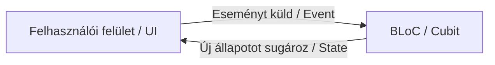

# 9. hét — Riverpod vagy Bloc alapok

## Cél
A lecke célja, hogy megismerd és magabiztosan használd a Flutter két legnépszerűbb, éles és nagyvállalati projektekben használt állapotkezelő (State Management) megoldását: a **Riverpod**-ot és a **Bloc**-ot (illetve annak egyszerűsített változatát, a **Cubit**-ot). Megérted a deklaratív és eseményvezérelt állapotkezelés működését, az aszinkron adatok (`AsyncValue`) kezelését, és képes leszel skálázható, tiszta és tesztelhető architektúrát kialakítani.

---

## Elmélet

### 1. Mi az a Riverpod és miért jobb, mint a Provider?
A Riverpod a népszerű `provider` csomag teljes újragondolása és továbbfejlesztése ugyanattól a szerzőtől (Remi Rousselet). Megoldja a Provider legfőbb hiányosságait:
*   **BuildContext függetlenség:** A Riverpod providerei globális konstansokként vannak deklarálva, így elérésükhöz nincs szükség a `BuildContext`-re. Ez lehetővé teszi, hogy az üzleti logikát teljesen leválasszuk az UI rétegről.
*   **Compile-time biztonság:** Provider esetén gyakran futottunk futásidejű hibára (`ProviderNotFoundException`), ha rossz helyen próbáltunk meg elérni egy tárolót. A Riverpod-nál ez a hiba fordítási időben kiderül.
*   **Több azonos típusú Provider:** Providerben nem lehetett két azonos típusú notifierünk a fában. A Riverpod-ban tetszőleges számú azonos típusú providert deklarálhatunk, mivel változónevek alapján azonosítjuk őket.

### 2. A legfontosabb Riverpod fogalmak
A Riverpod használatához le kell cserélnünk a hagyományos `StatelessWidget`-et `ConsumerWidget`-re, a `StatefulWidget`-et pedig `ConsumerStatefulWidget`-re. Ezzel megkapjuk a `WidgetRef` objektumot, ami a kulcsunk a providerekhez:
*   `ref.watch(provider)`: Figyeli a providert, és ha annak állapota változik, újraépíti (rebuild) a widgetet. A `build` metóduson belül **mindig** ezt használjuk.
*   `ref.read(provider)`: Csak lekéri a provider aktuális állapotát vagy metódusait feliratkozás nélkül. Gombok `onPressed` eseményénél használjuk.
*   `ref.listen(provider, (prev, next) { ... })`: Figyeli a változásokat, de nem építi újra a widgetet, hanem egy callbacket futtat le (pl. snackbar megjelenítésére vagy navigálásra).

#### Provider Típusok:
1.  **Provider:** Egyszerű, csak olvasható (read-only) értékekhez vagy Dependency Injection-höz (pl. API kliens osztály injektálása).
2.  **StateProvider:** Egyszerű, közvetlenül írható értékekhez (pl. számláló, keresési feltétel String).
3.  **FutureProvider:** Aszinkron kérésekhez (pl. API hívások). Egy `AsyncValue` típusú értéket ad vissza, aminek beépített állapotai vannak: betöltés (`Loading`), hiba (`Error`), és sikeres adat (`Data`).
4.  **NotifierProvider (modern Riverpod 2.0):** Komplex logikát és belső metódusokat tartalmazó osztályokhoz. A korábbi `StateNotifierProvider` utódja.

### 3. A Bloc (Business Logic Component) és Cubit koncepció
A Bloc az **eseményvezérelt (Event-driven)** programozásra épül. Nagyon szigorú struktúrája miatt kiválóan alkalmas nagy csapatok és komplex vállalati rendszerek számára.



#### A. Cubit (Egyszerűsített Bloc)
A Cubit egy olyan osztály, amely egy állapotot tárol, és normál függvényhívásokkal változtatja meg azt. Amikor a függvény lefut, az `emit(newState)` hívással küldi ki az új állapotot a külvilágnak.

#### B. Bloc (Teljes verzió)
A Bloc komplexebb: a UI nem függvényeket hív meg rajta, hanem **Eseményeket (Events)** küld (ad hozzá) a Bloc-hoz. A Bloc regisztrálja ezeket az eseményeket (`on<MyEvent>`), végrehajtja a szükséges üzleti logikát (pl. API kérés), majd kibocsátja az új **Állapotokat (States)**.

#### Bloc UI Widgetek:
*   `BlocProvider`: Dependency Injection, elérhetővé teszi a Bloc-ot a widget-fában.
*   `BlocBuilder`: Figyeli a Bloc állapotát és újraépíti az UI-t, ha változik (hasonló a `ref.watch`-hoz).
*   `BlocListener`: Csak egyszeri mellékhatásokat hajt végre (navigáció, snackbar), ha változik az állapot.
*   `BlocConsumer`: Egyesíti a `BlocBuilder` és `BlocListener` képességeit.

---

## Kódpéldák

### 1. Riverpod: Egyszerű számláló `StateProvider` segítségével
Telepítés: `flutter pub add flutter_riverpod`

Először a teljes appot be kell csomagolni egy `ProviderScope` widgetbe:
```dart
void main() {
  runApp(const ProviderScope(child: MyApp()));
}
```

Ezután hozzuk létre a providert és a widgetet:
```dart
import 'package:flutter/material.dart';
import 'package:flutter_riverpod/flutter_riverpod.dart';

// Globális deklaráció
final counterProvider = StateProvider<int>((ref) => 0);

// ConsumerWidget használata
class RiverpodCounterPage extends ConsumerWidget {
  const RiverpodCounterPage({super.key});

  @override
  Widget build(BuildContext context, WidgetRef ref) {
    // Figyeljük az állapotot
    final count = ref.watch(counterProvider);

    return Scaffold(
      appBar: AppBar(title: const Text('Riverpod Számláló')),
      body: Center(
        child: Text(
          'Érték: $count',
          style: const TextStyle(fontSize: 24),
        ),
      ),
      floatingActionButton: FloatingActionButton(
        onPressed: () {
          // Érték növelése a read segítségével
          ref.read(counterProvider.notifier).state++;
        },
        child: const Icon(Icons.add),
      ),
    );
  }
}
```

### 2. Riverpod: API lista betöltés `FutureProvider` és `AsyncValue.when` használatával

```dart
import 'dart:convert';
import 'package:flutter/material.dart';
import 'package:flutter_riverpod/flutter_riverpod.dart';
import 'package:http/http.dart' as http;

// 1. Aszinkron adatlekérő szolgáltatás
final itemsApiProvider = FutureProvider<List<String>>((ref) async {
  final response = await http.get(Uri.parse('https://jsonplaceholder.typicode.com/todos'));
  if (response.statusCode == 200) {
    final List<dynamic> data = jsonDecode(response.body);
    // Visszaadunk egy egyszerű String listát
    return data.map((item) => item['title'] as String).take(15).toList();
  } else {
    throw Exception('Szerverhiba: ${response.statusCode}');
  }
});

// 2. UI megvalósítás
class TodoListScreen extends ConsumerWidget {
  const TodoListScreen({super.key});

  @override
  Widget build(BuildContext context, WidgetRef ref) {
    // Az AsyncValue típust kapjuk vissza a FutureProvider-től
    final AsyncValue<List<String>> todoList = ref.watch(itemsApiProvider);

    return Scaffold(
      appBar: AppBar(title: const Text('Riverpod Todo Lista')),
      body: todoList.when(
        // Siker állapot
        data: (todos) => ListView.builder(
          itemCount: todos.length,
          itemBuilder: (context, index) => ListTile(
            leading: CircleAvatar(child: Text('${index + 1}')),
            title: Text(todos[index]),
          ),
        ),
        // Betöltés állapot
        loading: () => const Center(child: CircularProgressIndicator()),
        // Hiba állapot
        error: (error, stackTrace) => Center(
          child: Text('Hiba történt: $error', style: const TextStyle(color: Colors.red)),
        ),
      ),
    );
  }
}
```

### 3. Riverpod: Kosár állapotkezelés modern `Notifier` segítségével

```dart
import 'package:flutter_riverpod/flutter_riverpod.dart';

class CartItem {
  final String id;
  final String title;
  final int quantity;

  CartItem({required this.id, required this.title, required this.quantity});

  CartItem copyWith({int? quantity}) {
    return CartItem(
      id: id,
      title: title,
      quantity: quantity ?? this.quantity,
    );
  }
}

// Modern Notifier (Riverpod 2+)
class CartNotifier extends Notifier<List<CartItem>> {
  // Beállítjuk a kezdőállapotot (üres lista)
  @override
  List<CartItem> build() => [];

  // Műveletek az állapot megváltoztatására
  void addItem(String id, String title) {
    final existingIndex = state.indexWhere((item) => item.id == id);

    if (existingIndex >= 0) {
      // Ha már benne van, új listát hozunk létre (immutable state!)
      state = [
        for (int i = 0; i < state.length; i++)
          if (i == existingIndex)
            state[i].copyWith(quantity: state[i].quantity + 1)
          else
            state[i]
      ];
    } else {
      state = [...state, CartItem(id: id, title: title, quantity: 1)];
    }
  }

  void removeItem(String id) {
    state = state.where((item) => item.id != id).toList();
  }
}

// Provider deklaráció
final cartNotifierProvider = NotifierProvider<CartNotifier, List<CartItem>>(() {
  return CartNotifier();
});
```

### 4. Cubit: Számláló megvalósítása
Telepítés: `flutter pub add flutter_bloc`

```dart
import 'package:flutter_bloc/flutter_bloc.dart';

// 1. Cubit osztály létrehozása (a típus az állapot, most sima int)
class CounterCubit extends Cubit<int> {
  CounterCubit() : super(0); // Kezdőérték beállítása

  void increment() => emit(state + 1);
  void decrement() => emit(state - 1);
}

// 2. Használat az UI-ban
class CubitCounterPage extends StatelessWidget {
  const CubitCounterPage({super.key});

  @override
  Widget build(BuildContext context) {
    return BlocProvider(
      create: (_) => CounterCubit(),
      child: const CubitCounterView(),
    );
  }
}

class CubitCounterView extends StatelessWidget {
  const CubitCounterView({super.key});

  @override
  Widget build(BuildContext context) {
    return Scaffold(
      appBar: AppBar(title: const Text('Cubit Számláló')),
      body: Center(
        child: BlocBuilder<CounterCubit, int>(
          builder: (context, state) {
            return Text('Érték: $state', style: const TextStyle(fontSize: 24));
          },
        ),
      ),
      floatingActionButton: FloatingActionButton(
        // Esemény kiváltása metódus meghívásával
        onPressed: () => context.read<CounterCubit>().increment(),
        child: const Icon(Icons.add),
      ),
    );
  }
}
```

### 5. Bloc: Eseményalapú számláló megvalósítása
Szigorúbb, strukturált esemény-állapot leképezés.

```dart
import 'package:flutter/material.dart';
import 'package:flutter_bloc/flutter_bloc.dart';

// 1. Események deklarálása (Events)
sealed class CounterEvent {}
class CounterIncrementPressed extends CounterEvent {}
class CounterDecrementPressed extends CounterEvent {}

// 2. Bloc osztály
class CounterBloc extends Bloc<CounterEvent, int> {
  CounterBloc() : super(0) {
    // Eseménykezelők regisztrálása a modern on<Event> API-val
    on<CounterIncrementPressed>((event, emit) => emit(state + 1));
    on<CounterDecrementPressed>((event, emit) => emit(state - 1));
  }
}

// 3. UI
class BlocCounterPage extends StatelessWidget {
  const BlocCounterPage({super.key});

  @override
  Widget build(BuildContext context) {
    return BlocProvider(
      create: (_) => CounterBloc(),
      child: Scaffold(
        appBar: AppBar(title: const Text('Bloc Számláló')),
        body: Center(
          child: BlocBuilder<CounterBloc, int>(
            builder: (context, state) {
              return Text('Érték: $state', style: const TextStyle(fontSize: 24));
            },
          ),
        ),
        floatingActionButton: FloatingActionButton(
          // Esemény küldése a Bloc-nak!
          onPressed: () => context.read<CounterBloc>().add(CounterIncrementPressed()),
          child: const Icon(Icons.add),
        ),
      ),
    );
  }
}
```

---

## Gyakorlófeladatok & Megoldások

### 1. Feladat: Egyszerű számláló Riverpod StateProviderrel
Készíts egy képernyőt, ahol a számlálót nemcsak növelni, hanem csökkenteni és teljesen nullázni (reset) is lehet. A megvalósításhoz használd a Riverpod `StateProvider` típusát!

#### Megoldás:
```dart
import 'package:flutter/material.dart';
import 'package:flutter_riverpod/flutter_riverpod.dart';

final task1CounterProvider = StateProvider<int>((ref) => 0);

class RiverpodTask1Screen extends ConsumerWidget {
  const RiverpodTask1Screen({super.key});

  @override
  Widget build(BuildContext context, WidgetRef ref) {
    final count = ref.watch(task1CounterProvider);

    return Scaffold(
      appBar: AppBar(title: const Text('1. Feladat megoldás')),
      body: Center(
        child: Text('Érték: $count', style: const TextStyle(fontSize: 28)),
      ),
      bottomNavigationBar: Padding(
        padding: const EdgeInsets.all(16.0),
        child: Row(
          mainAxisAlignment: MainAxisAlignment.spaceEvenly,
          children: [
            ElevatedButton(
              onPressed: () => ref.read(task1CounterProvider.notifier).state--,
              child: const Text('Csökkent'),
            ),
            ElevatedButton(
              onPressed: () => ref.read(task1CounterProvider.notifier).state = 0,
              child: const Text('Nulláz'),
            ),
            ElevatedButton(
              onPressed: () => ref.read(task1CounterProvider.notifier).state++,
              child: const Text('Növel'),
            ),
          ],
        ),
      ),
    );
  }
}
```

### 2. Feladat: API terméklista FutureProviderrel
Hozz létre egy `FutureProvider`-t, amely egy szimulált terméklistát kér le (2 másodperc várakozás). Az UI-n jelenítsd meg a termékeket, és ha a letöltés során hiba történik (szimuláld egy véletlen hibadobással), jeleníts meg egy újrapróbálkozás gombot.

#### Megoldás:
```dart
import 'dart:math';
import 'package:flutter/material.dart';
import 'package:flutter_riverpod/flutter_riverpod.dart';

final simulatedProductsProvider = FutureProvider<List<String>>((ref) async {
  await Future.delayed(const Duration(seconds: 2));
  // Véletlenszerű hiba dobása a tesztelés kedvéért
  if (Random().nextBool()) {
    throw Exception('Sikertelen kapcsolódás a termékadatbázishoz!');
  }
  return ['Okostelefon', 'Laptop', 'Vezeték nélküli fülhallgató', 'Smart Watch'];
});

class RiverpodTask2Screen extends ConsumerWidget {
  const RiverpodTask2Screen({super.key});

  @override
  Widget build(BuildContext context, WidgetRef ref) {
    final products = ref.watch(simulatedProductsProvider);

    return Scaffold(
      appBar: AppBar(title: const Text('2. Feladat - API lista')),
      body: products.when(
        data: (list) => ListView(
          children: list.map((item) => ListTile(title: Text(item))).toList(),
        ),
        loading: () => const Center(child: CircularProgressIndicator()),
        error: (err, stack) => Center(
          child: Column(
            mainAxisAlignment: MainAxisAlignment.center,
            children: [
              Text('$err', style: const TextStyle(color: Colors.red)),
              const SizedBox(height: 10),
              ElevatedButton(
                onPressed: () {
                  // A refresh segítségével újraindítjuk a FutureProvider-t!
                  ref.refresh(simulatedProductsProvider);
                },
                child: const Text('Újrapróbálkozás'),
              )
            ],
          ),
        ),
      ),
    );
  }
}
```

### 3. Feladat: Kosár notifier Riverpod-ban
Módosítsd a Kódpéldák 3. pontjában leírt `CartNotifier` kódot úgy, hogy legyen benne egy `clearCart()` metódus is, ami teljesen kiüríti a kosarat, és az UI-n jelenítsd meg a kosár tartalmát és darabszámát egy listában.

#### Megoldás:
```dart
// Készítsünk egy tisztító függvényt a notifier osztályon belül:
// void clearCart() {
//   state = []; // Új üres tömb hozzárendelése kiváltja a frissítést
// }

// Használat az UI-n:
class CartViewWidget extends ConsumerWidget {
  const CartViewWidget({super.key});

  @override
  Widget build(BuildContext context, WidgetRef ref) {
    final cartItems = ref.watch(cartNotifierProvider);

    return Scaffold(
      appBar: AppBar(
        title: Text('Kosár (${cartItems.length} db elem)'),
        actions: [
          IconButton(
            icon: const Icon(Icons.delete),
            onPressed: () => ref.read(cartNotifierProvider.notifier).clearCart(),
          )
        ],
      ),
      body: ListView.builder(
        itemCount: cartItems.length,
        itemBuilder: (context, index) {
          final item = cartItems[index];
          return ListTile(
            title: Text(item.title),
            subtitle: Text('Mennyiség: ${item.quantity}'),
            trailing: IconButton(
              icon: const Icon(Icons.remove_circle),
              onPressed: () => ref.read(cartNotifierProvider.notifier).removeItem(item.id),
            ),
          );
        },
      ),
    );
  }
}
```

### 4. Feladat: Login állapot kezelése
Készíts egy `AuthNotifier` osztályt Riverpoddal, ami egy `AsyncValue<UserProfile?>` állapotot tárol. Bejelentkezéskor szimulálj egy 2 másodperces aszinkron folyamatot. Ha sikeres, mentsd el a profilt, ha hibás, állíts be hibaállapotot.

#### Megoldás:
```dart
import 'package:flutter_riverpod/flutter_riverpod.dart';

class UserProfile {
  final String name;
  UserProfile(this.name);
}

class AuthStateNotifier extends AutoDisposeNotifier<AsyncValue<UserProfile?>> {
  @override
  AsyncValue<UserProfile?> build() => const AsyncData(null); // Alapértelmezett állapot: nincs bejelentkezve

  Future<void> login(String username, String password) async {
    state = const AsyncLoading();
    
    await Future.delayed(const Duration(seconds: 2));

    if (username == 'admin' && password == '1234') {
      state = AsyncData(UserProfile('PrStart Rendszergazda'));
    } else {
      state = AsyncError('Hibás bejelentkezési adatok!', StackTrace.current);
    }
  }

  void logout() {
    state = const AsyncData(null);
  }
}

final authStateProvider = NotifierProvider.autoDispose<AuthStateNotifier, AsyncValue<UserProfile?>>(() {
  return AuthStateNotifier();
});
```

### 5. Feladat: Cubit számláló
Készítsd el a Kódpéldákban szereplő `CounterCubit` implementációt, és egészítsd ki úgy, hogy a `decrement` függvény ne engedje az értéket 0 alá csökkenteni.

#### Megoldás:
```dart
import 'package:flutter_bloc/flutter_bloc.dart';

class NonNegativeCounterCubit extends Cubit<int> {
  NonNegativeCounterCubit() : super(0);

  void increment() => emit(state + 1);

  void decrement() {
    if (state > 0) {
      emit(state - 1);
    }
  }
}
```

---

## Heti Mini Projekt: Időjárás app Riverpoddal

Ebben a mini projektben egy komplett időjárás kereső alkalmazást építünk fel Riverpod állapotkezeléssel.
A projekt bemutatja:
*   A keresési feltételek reaktív figyelését.
*   Az aszinkron API hívások (`FutureProvider`) összekapcsolását a beviteli mezővel.
*   A kedvenc városok listájának tárolását (`Notifier`).

### 1. Fájl: `weather_models.dart` (Adatmodellek)
```dart
class WeatherData {
  final String cityName;
  final double temperature;
  final String condition;
  final int humidity;

  WeatherData({
    required this.cityName,
    required this.temperature,
    required this.condition,
    required this.humidity,
  });
}
```

### 2. Fájl: `weather_providers.dart` (Riverpod tárolók)
```dart
import 'dart:math';
import 'package:flutter_riverpod/flutter_riverpod.dart';
import 'weather_models.dart';

// 1. A keresett város állapot tárolója (alapértelmezett: Budapest)
final searchCityProvider = StateProvider<String>((ref) => 'Budapest');

// 2. Aszinkron Weather API szimuláció a keresett város alapján
final weatherDataProvider = FutureProvider<WeatherData>((ref) async {
  // Figyeljük a keresett város változásait!
  final city = ref.watch(searchCityProvider);

  if (city.isEmpty) {
    throw Exception('Kérjük, írj be egy városnevet!');
  }

  // Szimulált API hívás késleltetés
  await Future.delayed(const Duration(seconds: 1));

  // Véletlenszerű időjárás generálás az adott városhoz
  final random = Random();
  final temp = 15.0 + random.nextInt(20); // 15 és 35 fok között
  final conditions = ['Napos', 'Esős', 'Felhős', 'Zivataros'];
  final condition = conditions[random.nextInt(conditions.length)];

  return WeatherData(
    cityName: city,
    temperature: temp,
    condition: condition,
    humidity: 40 + random.nextInt(50),
  );
});

// 3. Kedvenc városok Notifier-je
class FavoritesNotifier extends Notifier<List<String>> {
  @override
  List<String> build() => ['Budapest', 'Debrecen', 'Győr'];

  void toggleFavorite(String city) {
    final normalizedCity = city.trim();
    if (state.contains(normalizedCity)) {
      state = state.where((item) => item != normalizedCity).toList();
    } else {
      state = [...state, normalizedCity];
    }
  }
}

final favoritesProvider = NotifierProvider<FavoritesNotifier, List<String>>(() {
  return FavoritesNotifier();
});
```

### 3. Fájl: `main.dart` (UI megvalósítás)
```dart
import 'package:flutter/material.dart';
import 'package:flutter_riverpod/flutter_riverpod.dart';
import 'weather_models.dart';
import 'weather_providers.dart';

void main() {
  runApp(
    const ProviderScope(
      child: WeatherApp(),
    ),
  );
}

class WeatherApp extends StatelessWidget {
  const WeatherApp({super.key});

  @override
  Widget build(BuildContext context) {
    return MaterialApp(
      title: 'PrStart Időjárás',
      debugShowCheckedModeBanner: false,
      theme: ThemeData(
        colorScheme: ColorScheme.fromSeed(seedColor: Colors.blue),
        useMaterial3: true,
      ),
      home: const WeatherHomeScreen(),
    );
  }
}

class WeatherHomeScreen extends ConsumerStatefulWidget {
  const WeatherHomeScreen({super.key});

  @override
  ConsumerState<WeatherHomeScreen> createState() => _WeatherHomeScreenState();
}

class _WeatherHomeScreenState extends ConsumerState<WeatherHomeScreen> {
  final _controller = TextEditingController();

  @override
  void dispose() {
    _controller.dispose();
    super.dispose();
  }

  @override
  Widget build(BuildContext context) {
    // Figyeljük a weatherDataProvider-t
    final weatherState = ref.watch(weatherDataProvider);
    final favorites = ref.watch(favoritesProvider);
    final currentSearch = ref.watch(searchCityProvider);

    return Scaffold(
      appBar: AppBar(
        title: const Text('PrStart Időjárás-jelentés'),
        centerTitle: true,
      ),
      body: Padding(
        padding: const EdgeInsets.all(16.0),
        child: Column(
          crossAxisAlignment: CrossAxisAlignment.stretch,
          children: [
            // Keresőmező gombbal
            Row(
              children: [
                Expanded(
                  child: TextField(
                    controller: _controller,
                    decoration: const InputDecoration(
                      labelText: 'Város keresése',
                      border: OutlineInputBorder(),
                    ),
                  ),
                ),
                const SizedBox(width: 10),
                ElevatedButton(
                  style: ElevatedButton.styleFrom(
                    padding: const EdgeInsets.symmetric(vertical: 18),
                  ),
                  onPressed: () {
                    // Beállítjuk a keresett várost, ez automatikusan elindítja a FutureProvider-t!
                    ref.read(searchCityProvider.notifier).state = _controller.text;
                    FocusScope.of(context).unfocus();
                  },
                  child: const Icon(Icons.search),
                ),
              ],
            ),
            const SizedBox(height: 20),

            // Időjárás kijelző kártya (AsyncValue.when használata)
            weatherState.when(
              data: (weather) {
                final isFav = favorites.contains(weather.cityName);
                return Card(
                  color: Colors.blue.shade50,
                  elevation: 4,
                  child: Padding(
                    padding: const EdgeInsets.all(20.0),
                    child: Column(
                      children: [
                        Row(
                          mainAxisAlignment: MainAxisAlignment.spaceBetween,
                          children: [
                            Text(
                              weather.cityName,
                              style: const TextStyle(fontSize: 24, fontWeight: FontWeight.bold),
                            ),
                            IconButton(
                              icon: Icon(isFav ? Icons.star : Icons.star_border, color: Colors.amber),
                              onPressed: () {
                                ref.read(favoritesProvider.notifier).toggleFavorite(weather.cityName);
                              },
                            )
                          ],
                        ),
                        const SizedBox(height: 15),
                        Text(
                          '${weather.temperature.toStringAsFixed(1)} °C',
                          style: const TextStyle(fontSize: 48, fontWeight: FontWeight.w300, color: Colors.blue),
                        ),
                        const SizedBox(height: 10),
                        Text('Állapot: ${weather.condition}', style: const TextStyle(fontSize: 18)),
                        Text('Páratartalom: ${weather.humidity}%'),
                      ],
                    ),
                  ),
                );
              },
              loading: () => const Center(
                child: Padding(
                  padding: EdgeInsets.all(30.0),
                  child: CircularProgressIndicator(),
                ),
              ),
              error: (err, stack) => Card(
                color: Colors.red.shade50,
                child: Padding(
                  padding: const EdgeInsets.all(16.0),
                  child: Text('Hiba: $err', style: const TextStyle(color: Colors.red)),
                ),
              ),
            ),
            const SizedBox(height: 25),

            // Kedvencek listája
            const Text(
              'Mentett kedvenc városok:',
              style: TextStyle(fontSize: 18, fontWeight: FontWeight.bold),
            ),
            const SizedBox(height: 10),
            Expanded(
              child: ListView.builder(
                itemCount: favorites.length,
                itemBuilder: (context, index) {
                  final city = favorites[index];
                  return Card(
                    child: ListTile(
                      title: Text(city),
                      trailing: const Icon(Icons.arrow_forward_ios, size: 16),
                      onTap: () {
                        _controller.text = city;
                        ref.read(searchCityProvider.notifier).state = city;
                      },
                    ),
                  );
                },
              ),
            )
          ],
        ),
      ),
    );
  }
}
```

---

## Heti Ellenőrző Kérdések

### 1. Miért nem szükséges a Riverpod használatakor a `BuildContext` az állapot eléréséhez?
Mivel a Riverpod providerei globális konstansokként vannak deklarálva a fájl szintjén (nem a widget-fában), nem függenek a widget-fa hierarchiájától. Az állapot olvasásához és írásához a `WidgetRef` (vagy más providerekben a `Ref`) objektumot használjuk, ami közvetlenül a Riverpod belső konténeréhez kapcsolódik. Így az üzleti logikát és az API kéréseket tetszőleges Dart osztályba kiszervezhetjük, ahol egyáltalán nincs jelen a Flutter UI (`BuildContext`) importja.

### 2. Mi a szerepe az `AsyncValue`-nak és hogyan teszi biztonságosabbá az aszinkron UI kódokat?
Az `AsyncValue` egy speciális wrapper típus Riverpod-ban az aszinkron adatok biztonságos kezelésére. Három állapota lehet: `AsyncData` (siker), `AsyncLoading` (betöltés), és `AsyncError` (hiba). A beépített `.when(...)` metódusa fordítási időben kötelezővé teszi mindhárom állapot lekezelését a fejlesztő számára. Ezzel megelőzhető az egyik leggyakoribb futásidejű hiba, amikor az UI megpróbálna megjeleníteni egy még le nem töltődött (`null`) értéket.

### 3. Mikor használjuk a `ref.watch`-ot és mikor a `ref.read`-et Riverpodban?
A `ref.watch`-ot a widgetek `build` metódusán belül használjuk az adatok figyelésére. Ha a figyelt provider állapota megváltozik, a widget újraépül.
A `ref.read`-et eseménykezelőkben (pl. gombnyomás callback-je: `onPressed`) használjuk, ahol nem feliratkozni akarunk az érték változására, hanem csak lefutattni egy metódust a provideren (pl. `ref.read(cartProvider.notifier).addItem(...)`). Ezzel megóvjuk a widgetet a felesleges újraépülésektől.

### 4. Mi a legfőbb különbség a Bloc és a Cubit között?
A **Cubit** egy egyszerűsített állapotgép, ahol az állapotváltozásokat közvetlen függvényhívásokkal indítjuk el az osztályon belül.
A **Bloc** ezzel szemben teljesen eseményvezérelt: az UI-ból nem függvényeket hívunk, hanem egy **Event** objektumot küldünk (adunk hozzá) a Bloc-nak. A Bloc ezt aszinkron módon feldolgozza, és egy új **State** állapotot bocsát ki. A Bloc kiválóan használható nagyon komplex üzleti folyamatokhoz és esemény-naplózásokhoz, míg a Cubit az egyszerűbb feladatokhoz ajánlott.

### 5. Milyen esetben használnál `BlocListener`-t a `BlocBuilder` helyett?
A `BlocBuilder`-t akkor használjuk, ha az állapot változását közvetlenül meg akarjuk jeleníteni a képernyőn (UI kirajzolás).
A `BlocListener`-t akkor használjuk, ha az állapot változásakor csak egy egyszeri mellékhatást (action) akarunk végrehajtani, amit nem akarunk a képernyőn widgetként kirajzolni. Ilyen például a navigáció (pl. sikeres login után átirányítás), egy SnackBar hibaüzenet felvillantása, vagy egy felugró dialógusablak megnyitása.
